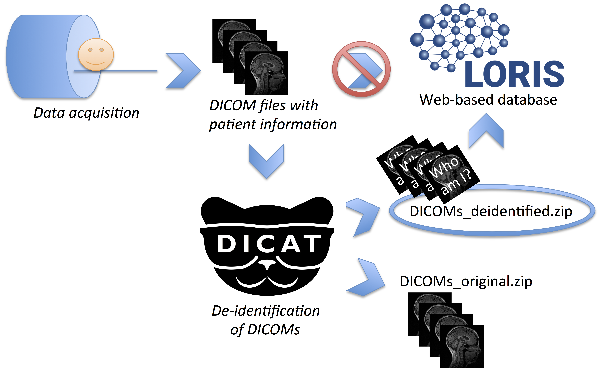
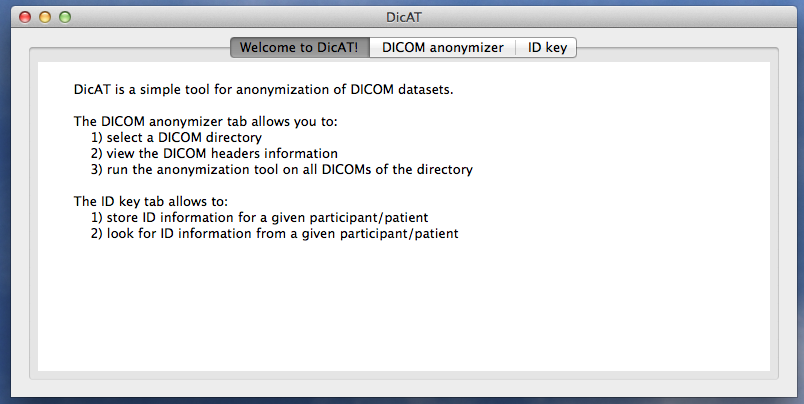
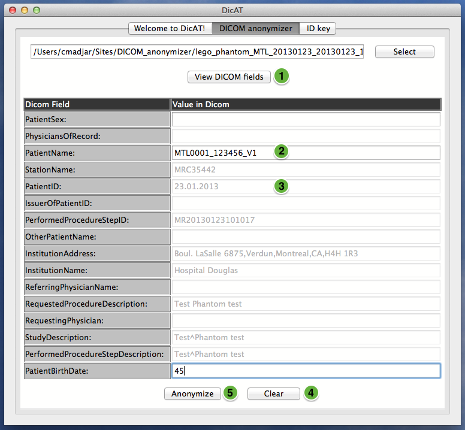
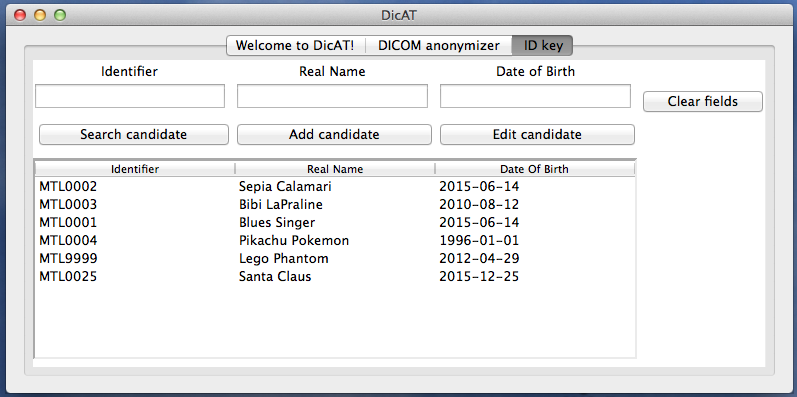

# DicAT (DICOM Anonymization Tool)

DicAT is a simple graphical tool that facilitates DICOM (Digital Imaging and Communications in Medicine) de-identification directly on a local workstation.
It works on all major operating systems (Windows, Linux and OSX) and is very light in terms of dependencies.

With the increasing use of web-based database systems, such as [LORIS](http://www.loris.ca) ([Das *et al.*, 2011](http://journal.frontiersin.org/article/10.3389/fninf.2011.00037/full), [Das *et al.*, 2016](http://www.sciencedirect.com/science/article/pii/S1053811915008009)), for large scale imaging studies, de-identification of DICOM datasets becomes a requirement before they can be uploaded in such databases.



***Typical Flow Chart of DICOM de-identification.***

Before DICOM datasets can be uploaded into a web-based database, identifying information stored in the DICOM header (such as patient name, date of birth) should be removed.

DicAT produces two archival outputs: a back-up of the original DICOM files, and a de-identified DICOM dataset that can then be uploaded or transferred to other systems.

DicAT also features an ID key log that can be used to keep a record of the original candidate name (participant/patient) linked to their anonymized study identifier, for reference by study coordinators. 

DicAT was first developed during the [2014 and 2015 brainhacks](http://brainhack.org) held at the [Organization of Human Brain Mapping (OHBM)](http://www.humanbrainmapping.org/i4a/pages/index.cfm?pageid=1) conferences.

## How to install and run DicAT

Installation instructions vary depending on the operating system used. See below for detailed information.

Running DicAT will open a window with three different tabs:

* A simple **"Welcome to DicAT"** tab giving a short description of the tool
* A **"DICOM anonymizer"** tab, in which de-identification of DICOMs will take place 
* An **"ID Key"** tab, containing the key between candidate's names and their IDs.



***Welcome page of DicAT.***

### On UNIX operating systems (Linux and OS X) 

To install DicAT on a computer, download and save the content of the current repository into a workstation.

DicAT can be started by executing `DicAT_application.py` script with a Python compiler. Once in the main directory of DicAT, run the following:

```python DicAT_application.py```

### On Windows operating system

To install DicAT, download the following zip archive `Zip_file_with_Windows_executable.zip` containing the DicAT executable and libraries. Extract the content of the archive onto a workstation.

Once the archive has been extracted, double-clicking on the ==anonymizer_gui.exe== executable will open the application.

## How to use the DICOM anonymizer of DicAT?

#### DICOM anonymizer tab of the application and selection of a directory containing DICOM files


***DICOM anonymizer tab of DicAT.*** 

In the *"DICOM anonymizer"* tab (1), use the select button (2) to choose a directory containing DICOM files to anonymize.

#### View/edit the DICOM fields and de-identify the DICOM files



***View DICOM fields and anonymize the dataset.*** 

Once a directory containing DICOM files have been selected (as described in the above section), the DICOM fields can be viewed when clicking on the *“View DICOM fields”* button (1).

 The DICOM fields will be displayed in a table with editable fields in black (2) and non-editable fields greyed out (3). The non-editable fields will be replaced by empty strings in the DICOM files when running the anonymization, while the editable fields will be replaced by the value entered by the user. By default, editable fields are *“PatientName”*, *“PatientBirthDate”* and *“PatientSex”*. ==Mention how to configure editable fields== 
 
The *“Clear”* button (4) will erase values from all editable fields. 

Finally, once the user has finalized the edits, clicking on the *“Anonymize”* button (5) will run the anonymization tool on the DICOM dataset. The non-editable fields will be replaced by empty strings in the DICOM files when running the anonymization, while the editable fields will be replaced by what is being entered by the user. 


## How to use the ID Key of DicAT

The ID Key feature of DicAT allows storage of the key between identifiable candidates's information (*Real Name* and *Date of Birth*) and its study’s identifier. This information will be stored locally on the workstation within an XML file (candidate.xml) in DicAT's directory. See the following figure for detailed information on how to use this feature.



***ID key feature of DicAT.*** 

This feature allows storage of the mapping information between candidates’s information and study IDs. 

A candidate (participant/patient) can be looked up using the *“Search candidate”* button (2) after having entered either the *“Identifier”* or the *“Real Name”* text fields available in the top row (1). 

The *“Clear fields”* button (3) allows clearing the text in those text fields. 

A new candidate can be registered using the *“Add candidate”* button (4) after having entered the *“Identifier”*, *“Real Name”* and *“Date of birth”* information in the text fields of the top row (1). 

Clicking on a subject row (5) of the table displayed at the bottom of the application will automatically populate the text fields (1) with the information of the candidate. 

The *“Real Name”* or *“Date of birth”* of that candidate can be edited if needed by altering the field and clicking on the *“Edit candidate”* button (6). 

Finally, the data table of candidate is sortable by clicking on any of the column headers (7).

## Authors

Ayan Sengupta <uam111@gmail.com>              - Concept, DICOM-toolkit implementation, Pydicom implementation   

Cecile Madjar <cecile.madjar@gmail.com>       - GUI implementation, PyDICOM implementation, python integration of DICOM-toolkit

Dave MacFarlane <david.macfarlane2@mcgill.ca> - ID Key

Samir Das <samir.das@mcgill.ca>               - Concept and guidance

Daniel Krötz <d.kroetz@fz-juelich.de>         - Documentation, testing on Windows

Christine Rogers <christine.rogers@mcgill.ca> - Documentation
