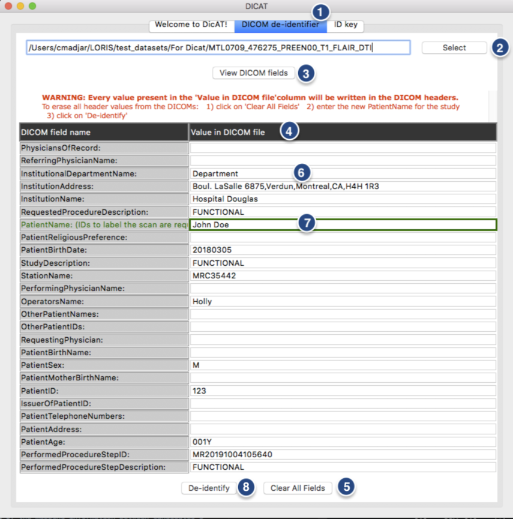
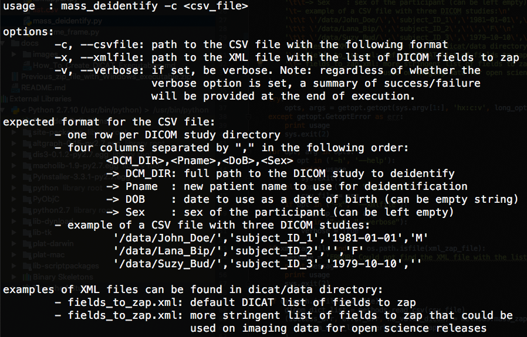

# DICAT (DICOM Anonymization Tool)

DICAT is a simple graphical tool that facilitates DICOM (Digital Imaging and 
Communications in Medicine) de-identification directly on a local workstation. 
It was designed to work on all major operating systems (Windows, Linux and OSX) 
and is very light in terms of dependencies (Python). Binaries (with no 
dependencies) have been compiled for all operating systems and made available 
with each [release of DICAT](https://github.com/aces/DICAT/releases).

With the increasing use of web-based database systems, such as 
[LORIS](http://www.loris.ca) 
([Das *et al.*, 2011](http://journal.frontiersin.org/article/10.3389/fninf.2011.00037/full), 
[Das *et al.*, 2016](http://www.sciencedirect.com/science/article/pii/S1053811915008009)), 
for large scale imaging studies, de-identification of DICOM datasets becomes a 
requirement before they can be uploaded in such databases.


***Typical Flow Chart of DICOM de-identification.***

Before DICOM datasets can be uploaded into a web-based database, identifying 
information stored in the DICOM header (such as patient name, date of birth) 
should be removed.

DICAT produces two archival outputs: a back-up of the original DICOM files, and 
a de-identified DICOM dataset that can then be uploaded or transferred to other 
systems.

DICAT also features an ID key log that can be used to keep a record of the 
original candidate name (participant/patient) linked to their anonymized study 
identifier, for reference by study coordinators. 

DICAT was first developed during the 
[2014 and 2015 brainhacks](http://brainhack.org) held at the 
[Organization of Human Brain Mapping (OHBM)](http://www.humanbrainmapping.org/i4a/pages/index.cfm?pageid=1) 
conferences.

## How to install and run DICAT

Installation instructions vary depending on the operating system used. 
See below for detailed information.

Running DICAT will open a window with three different tabs:

* A simple **"Welcome to DICAT"** tab giving a short description of the tool
* A **"DICOM de-identifier"** tab, in which DICOM de-identification will take place 
* An **"ID Key"** tab, containing the key between candidates' name and their IDs


***Welcome page of DICAT.***

### Using DICAT executables/applications

Executables of DICAT have been created for most systems and can be found with 
each [release](https://github.com/aces/DICAT/releases) of DICAT in the Github 
repository. Download the executable relevant to your system and move it to any 
folder of your choice.

To open DICAT, simply double click on the executable.

Please note that for some obscure reason, DICAT is extremely slow to run on 
Windows OS.

### From the source code

###### Requirements 

Before running DICAT, make sure your system contains a 
[Python](https://www.python.org) compiler with the 
[TkInter](https://wiki.python.org/moin/TkInter) library (usually, TkInter comes 
by default with most Python installations).

For Ubuntu distributions, TkInter can be installed via apt-get:
```sudo apt-get install python-tk```

The [PyDICOM](https://pydicom.readthedocs.io/en/stable/getting_started.html#installing) 
package is also required by DICAT. 

For most platform, PyDICOM can be installed via easy_install: 
```sudo easy_install pydicom``` 


###### DICAT installation


To install DICAT source code on a computer, download and save the content of 
the current Github repository into a workstation.

DICAT can be started by executing `DICAT.py` script with a Python compiler. 
On UNIX computers (Linux and Mac OS X), open a terminal, go to the main 
directory of DICAT source code (`dicat` directory) and run the following:
```python DICAT.py```


## How to use the DICOM de-identifier of DICAT?




***DICOM de-identification with the DICAT GUI*** 

In the *"DICOM de-identifier"* tab (1), use the select button (2) to choose a 
directory containing DICOM files to de-identify.

Once a directory containing DICOM files have been selected (as described in the 
above section), the DICOM fields can be viewed when clicking on the 
*“View DICOM fields”* button (3).

The DICOM identifiable fields will be displayed in a table with editable fields (4). 

Users can choose to delete all identifiable fields using the *“Clear All Fields”* 
button (5). 

Users can also directly edit the fields (6) in the table and all values present in 
the table will be inserted into the corresponding DICOM fields in the imaging files.
> Note that the PatientName field is required (7) and will need to be filled 
with new IDs in order to label the scan for that session.

Finally, once the user has finalized the edits, clicking on the *“De-identify”* 
button (8) will run the de-identification tool on the DICOM dataset. 

***Mass DICOM de-identification using `mass_deidentify.py`***

The script `mass_deidentify.py` in the `dicat` directory allows a user to 
mass de-identify a series of DICOM studies. Running `mass_deidentify.py -h` 
will display the following information on how to run the script:



## How to use the ID Key of DICAT

The ID Key feature of DICAT allows storage of the key between identifiable 
candidates's information (*Real Name* and *Date of Birth*) and its study’s 
identifier. This information will be stored locally on the workstation within 
an XML file (candidate.xml) in DICAT's directory. See the following figure for 
detailed information on how to use this feature.


***ID key feature of DICAT.*** 

This feature (1) allows storage of the mapping information between candidates’s 
information and study IDs. This information will be stored in an XML file that 
can be either created (2) or opened (3). Changes will be automatically saved. 

A candidate (participant/patient) can be looked up using the 
*“Search candidate”* button (5) after having entered either the *“Identifier”* 
or the *“Real Name”* text fields available in (4). 

The *“Clear fields”* button (6) allows clearing the text in those text fields. 

A new candidate can be registered using the *“Add candidate”* button (7) after 
having entered the *“Identifier”*, *“Real Name”* and *“Date of birth”* 
information in the text fields of (4). 

Clicking on a subject row (8) of the table displayed at the bottom of the 
application will automatically populate the text fields (4) with the 
information of the candidate. 

The *“Real Name”* or *“Date of birth”* of that candidate can be edited if 
needed by altering the field and clicking on the *“Edit candidate”* button (9). 

Finally, the data table of candidate is sortable by clicking on any of the 
column headers (10).


## Authors

Ayan Sengupta <uam111@gmail.com>              - Concept, Pydicom implementation   

Cecile Madjar <cecile.madjar@gmail.com>       - GUI implementation, PyDICOM implementation, python integration of DICOM-toolkit, ID key

Dave MacFarlane <david.macfarlane2@mcgill.ca> - ID Key

Samir Das <samir.das@mcgill.ca>               - Concept and guidance

Daniel Krötz <d.kroetz@fz-juelich.de>         - Documentation, testing on Windows

Christine Rogers <christine.rogers@mcgill.ca> - Documentation

Leigh Evans <evansleigh26@gmail.com>          - Video tutorial

Derek Lo <derek.lo@mcgill.ca>                 - Logo design
